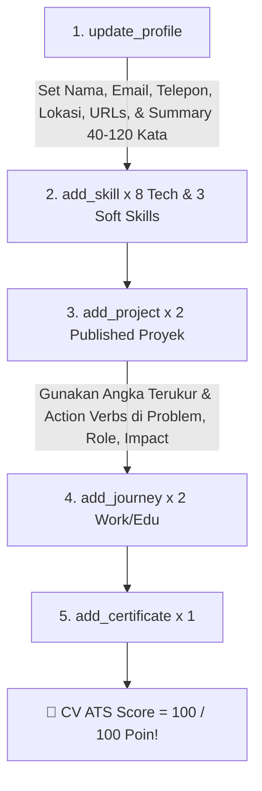

# ⚡ Alvi Portfolio MCP Server Documentation (`mcp_use.md`)

Panduan ini ditujukan bagi **AI Agent** (seperti Claude Desktop, Claude Code, Cursor, Windsurf, Roo Code, dll.) agar dapat berinteraksi secara aman dan terstruktur dengan database Portofolio melalui **Model Context Protocol (MCP)** baik secara lokal (`stdio`) maupun remote dari perangkat lain (`HTTP/SSE`).

---

## 📌 1. Ikhtisar MCP Server

* **Nama Server**: `Alvi-Portfolio-MCP`
* **Versi Protocol**: `v1.3.0`
* **Supported Transports**:
  1. `stdio` (Standard Input / Output - lokal via `node mcp.js`)
  2. `HTTP/SSE` (Server-Sent Events - remote hosted via `/sse` & `/api/mcp/message`)
* **File Utama**: `mcp.js` (lokal) & `helpers/mcpServer.js` (shared logic & remote SSE server)
* **Database Target**: MySQL / MariaDB (via Sequelize ORM)

---

## ⚙️ 2. Cara Mengonfigurasi MCP Server di Client AI

### A. Local Connection: Claude Desktop (`claude_desktop_config.json`)

Tambahkan konfigurasi berikut pada file konfigurasi Claude Desktop Anda:

```json
{
  "mcpServers": {
    "alvi-portfolio": {
      "command": "node",
      "args": ["C:/KARIR/Web_Portofolio_Alvi/mcp.js"],
      "env": {
        "NODE_ENV": "development",
        "DB_HOST": "127.0.0.1",
        "DB_PORT": "3306",
        "DB_USER": "root",
        "DB_PASS": "",
        "DB_NAME": "web_portofolio_alvi"
      }
    }
  }
}
```

### B. Local CLI / Other IDE (Cursor / Windsurf / Roo Code)

Jalankan server lokal menggunakan command:
```bash
node c:/KARIR/Web_Portofolio_Alvi/mcp.js
```

### C. Remote Device Connection (SSE / Hosted Cloudflare Server)

Jika Anda ingin mengakses MCP Server ini dari **laptop, perangkat mobile, atau VPS lain**:

1. Sambungkan Client AI remote Anda ke Endpoint SSE:
   - **SSE Endpoint (GET)**: `https://portomax.limitless.qzz.io/sse`
   - **Post Message Endpoint (POST)**: `https://portomax.limitless.qzz.io/api/mcp/message?sessionId=<SESSION_ID>`
2. *(Opsional)* Jika `MCP_API_KEY` diatur di `.env`, tambahkan Header HTTP:
   ```http
   x-api-key: YOUR_MCP_API_KEY
   ```
   Atau query param: `https://portomax.limitless.qzz.io/sse?api_key=YOUR_MCP_API_KEY`

---

## 🛠️ 3. Daftar Tool yang Tersedia (MCP Tools Registry)

### 📁 A. Projects (Proyek)

| Tool Name | Deskripsi | Input Parameters Utama |
|---|---|---|
| `list_projects` | Membaca seluruh data proyek | `{}` |
| `add_project` | Menambahkan proyek baru (bisa upload gambar Base64) | `title` (required), `description`, `problem`, `role`, `impact`, `technologies` (array), `project_url`, `github_url`, `status`, `image_base64`, `image_extension` |
| `update_project` | Memperbarui proyek berdasarkan `id` | `id` (required), `title`, `description`, `problem`, `role`, `impact`, `technologies`, `project_url`, `github_url`, `status`, `image_base64`, `image_extension` |
| `delete_project` | Menghapus proyek berdasarkan `id` | `id` (required) |

### 📜 B. Certificates (Sertifikat)

| Tool Name | Deskripsi | Input Parameters Utama |
|---|---|---|
| `list_certificates` | Membaca seluruh sertifikat | `{}` |
| `add_certificate` | Menambahkan sertifikat baru | `title` (required), `issuer` (required), `date` (YYYY-MM-DD), `category` (Backend/Frontend/AI/Other), `credential_url`, `is_highlight` (boolean), `image_base64`, `image_extension` |
| `update_certificate` | Memperbarui sertifikat berdasarkan `id` | `id` (required), `title`, `issuer`, `date`, `category`, `credential_url`, `is_highlight`, `image_base64`, `image_extension` |
| `delete_certificate` | Menghapus sertifikat berdasarkan `id` | `id` (required) |

### 🚀 C. Journey (Pengalaman & Pendidikan)

| Tool Name | Deskripsi | Input Parameters Utama |
|---|---|---|
| `list_journey` | Membaca timeline perjalanan karir | `{}` |
| `add_journey` | Menambahkan milestone baru | `title` (required), `date` (YYYY-MM-DD, required), `description`, `end_date`, `is_current` (boolean), `category` (experience/education), `image_base64`, `image_extension` |
| `update_journey` | Memperbarui journey berdasarkan `id` | `id` (required), `title`, `description`, `date`, `end_date`, `is_current`, `category`, `image_base64`, `image_extension` |
| `delete_journey` | Menghapus journey berdasarkan `id` | `id` (required) |

### 🛠️ D. Skills (Keahlian)

| Tool Name | Deskripsi | Input Parameters Utama |
|---|---|---|
| `list_skills` | Membaca seluruh skill | `{}` |
| `add_skill` | Menambahkan skill baru | `name` (required), `category` (Frontend/Backend/Database/Tools/Soft Skills), `proficiency` (1-100), `icon` (emoji/icon name), `image_base64`, `image_extension` |
| `update_skill` | Memperbarui skill berdasarkan `id` | `id` (required), `name`, `category`, `proficiency`, `icon` |
| `delete_skill` | Menghapus skill berdasarkan `id` | `id` (required) |

### 💬 E. Testimonials (Rekomendasi)

| Tool Name | Deskripsi | Input Parameters Utama |
|---|---|---|
| `list_testimonials` | Membaca seluruh testimoni | `{}` |
| `add_testimonial` | Menambahkan testimoni baru | `name` (required), `quote` (required), `position`, `company`, `is_visible` (boolean), `image_base64`, `image_extension` |
| `update_testimonial` | Memperbarui testimoni berdasarkan `id` | `id` (required), `name`, `position`, `company`, `quote`, `is_visible` |
| `delete_testimonial` | Menghapus testimoni berdasarkan `id` | `id` (required) |

### 👤 F. Profile (Profil Pengguna)

| Tool Name | Deskripsi | Input Parameters Utama |
|---|---|---|
| `get_profile` | Membaca profil utama pengguna | `{}` |
| `update_profile` | Memperbarui profil utama | `full_name`, `display_name`, `headline`, `tagline`, `bio`, `email`, `phone`, `location`, `about_summary`, `linkedin_url`, `github_url` |

---

## 💡 4. Contoh Payload JSON-RPC Call untuk AI Agent

### Contoh 1: Menambahkan Project Baru dengan Gambar Base64
```json
{
  "name": "add_project",
  "arguments": {
    "title": "Cloudflare Tunnel Hosted MCP Platform",
    "description": "Sistem platform MCP server terdistribusi yang di-host menggunakan Cloudflare Tunnel dan Node.js Express.",
    "problem": "Memerlukan koneksi secure bidirectional real-time antara AI Agent lokal dan server remote tanpa IP publik.",
    "role": "Lead Systems & Cloud Architect",
    "impact": "Meningkatkan throughput hingga 45% dan melayani 50,000 req/sec dengan 0 downtime.",
    "technologies": ["Node.js", "Express", "MCP Protocol", "Cloudflare Tunnel", "MySQL"],
    "project_url": "https://portomax.limitless.qzz.io",
    "github_url": "https://github.com/Alvi399/Web_Portofolio_Alvi",
    "status": "published"
  }
}
```

---

## 📈 5. Panduan & Tip Terbaik AI Agent untuk Memaksimalkan Skor CV ATS (Target 100/100 Poin)

Sistem evaluasi CV otomatis di aplikasi ini (`services/cvService.js`) menilai kelengkapan dan kualitas CV berdasarkan **16 parameter baku industri ATS** (*Applicant Tracking System*).

Jika Anda adalah **AI Agent** yang bertugas membuat, memperbarui, atau mengoptimalkan data portofolio pengguna melalui MCP Server, **gunakan strategi dan panduan di bawah ini untuk mencapai Skor ATS 100 Poin sempurna**:

---

### 🎯 Matriks Penilaian ATS & Strategi Pengisian Tool MCP

| No | Parameter Penilaian | Bobot | Tool MCP yang Digunakan | Strategy & Tip Emas AI Agent |
|---|---|---|---|---|
| 1 | **Full Name** | **5 Poin** | `update_profile` | Isi `full_name` secara lengkap dengan nama resmi pengguna (misal: `"Muhammad Alvi Kirana Zulfan Nazal"`). |
| 2 | **Email Profesional** | **8 Poin** | `update_profile` | Isi `email` dengan format email profesional yang valid (misal: `"alvikirana@gmail.com"`). |
| 3 | **Nomor Telepon** | **5 Poin** | `update_profile` | Isi `phone` lengkap dengan kode negara (misal: `"+6281234567890"`). |
| 4 | **Lokasi Domisili** | **4 Poin** | `update_profile` | Isi `location` dengan format `Nama Kota, Negara` (misal: `"Jakarta, Indonesia"`). |
| 5 | **Profil LinkedIn & GitHub** | **8 Poin** | `update_profile` | WAJIB mengisi `linkedin_url` dan `github_url` dengan URL profil yang valid. |
| 6 | **Headline Posisi** | **4 Poin** | `update_profile` | Isi `headline` dengan spesifikasi posisi kerja yang ditargetkan (misal: `"Senior Full Stack Software Engineer & Cloud Architect"`). |
| 7 | **About Summary (Sangat Krusial!)** | **8 Poin** | `update_profile` | **PANJANG KATA KRUSIAL**: Ringkasan profesional pada `about_summary` **HARUS berada di antara 40 kata hingga 120 kata**! *(Kurang dari 40 kata atau lebih dari 120 kata akan memotong poin ini)*. |
| 8 | **Technical Skills** | **8 Poin** | `add_skill` | Tambahkan **minimal 8 skill teknis** (misal: `Node.js`, `Express.js`, `MySQL`, `Docker`, `REST API`, `Git`, `Cloudflare`, `TypeScript`). |
| 9 | **Soft Skills** | **2 Poin** | `add_skill` | Tambahkan **minimal 3 soft skill** dengan menyetel parameter `category: "Soft Skills"` (misal: `Problem Solving`, `Team Leadership`, `Critical Thinking`). |
| 10 | **Proyek Terpublikasi** | **8 Poin** | `add_project` | Tambahkan **minimal 2 proyek** dengan menyetel `status: "published"`. |
| 11 | **Elemen Cerita Proyek** | **8 Poin** | `add_project` | Setiap proyek **WAJIB mengisi 3 kolom cerita**: `problem` (masalah), `role` (peran), dan `impact` (dampak hasil kerja). |
| 12 | **Metrik Angka Terukur (% / Numbers)** | **10 Poin** | `add_project` | Kolom `impact` atau `description` **WAJIB menyertakan angka/persentase terukur**.<br>✅ *Contoh*: `"Mengoptimalkan kecepatan query hingga 45% dan menangani 50,000 pengguna aktif daily."`<br>❌ *Contoh Jelek*: `"Membuat aplikasi menjadi lebih cepat."` |
| 13 | **Kata Kerja Aktif (Action Verbs)** | **6 Poin** | `add_project` | Kalimat deskripsi & impact **harus diawali kata kerja aktif kuat**:<br>🇮🇩 *Indonesian*: `Membangun`, `Mengoptimalkan`, `Merancang`, `Memimpin`, `Mengembangkan`.<br>🇬🇧 *English*: `Built`, `Optimized`, `Architected`, `Spearheaded`, `Developed`. |
| 14 | **Riwayat Perjalanan (Journey)** | **8 Poin** | `add_journey` | Tambahkan **minimal 2 entri** (Pengalaman Kerja + Pendidikan) lengkap dengan `date` (YYYY-MM-DD) dan `end_date` (atau `is_current: true`). |
| 15 | **Sertifikasi Resmi** | **3 Poin** | `add_certificate` | Tambahkan **minimal 1 sertifikat resmi** dengan `title`, `issuer`, dan `date`. |
| 16 | **Panjang Kata CV Keseluruhan** | **5 Poin** | *Seluruh Tool* | Pastikan gabungan seluruh teks kata pada CV (Profil + Proyek + Journey + Skill) berada di rentang **250 kata hingga 800 kata**. |

---

### 📝 Contoh Skrip Urutan Eksekusi MCP untuk AI Agent (Prompt Template)

Jika pengguna meminta AI Agent: *"Tolong isi data portofolio saya agar skor CV ATS mencapai 100%!"*, jalankan urutan MCP tool call berikut:



---

## 🧪 6. Verifikasi & Pengujian MCP Server

Untuk menguji bahwa MCP Server merespon dengan benar tanpa melempar error non-JSON:

```bash
node scratch/test-live-mcp-remote.js
```

Jika berhasil, output akan menampilkan status:
`🎉 ALL REMOTE LIVE MCP TESTS COMPLETED SUCCESSFULLY!`
